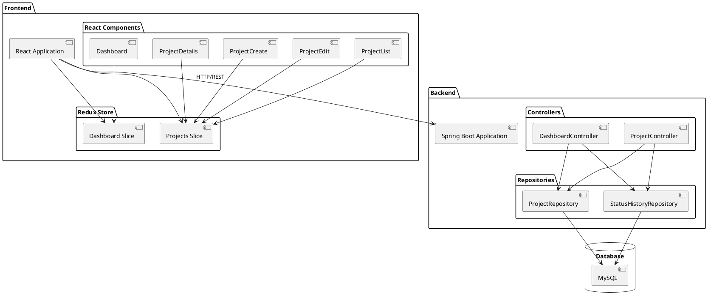
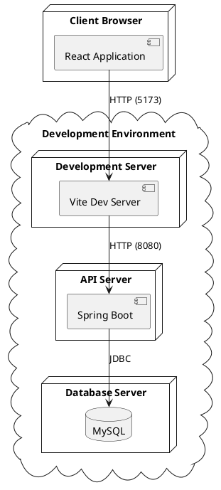
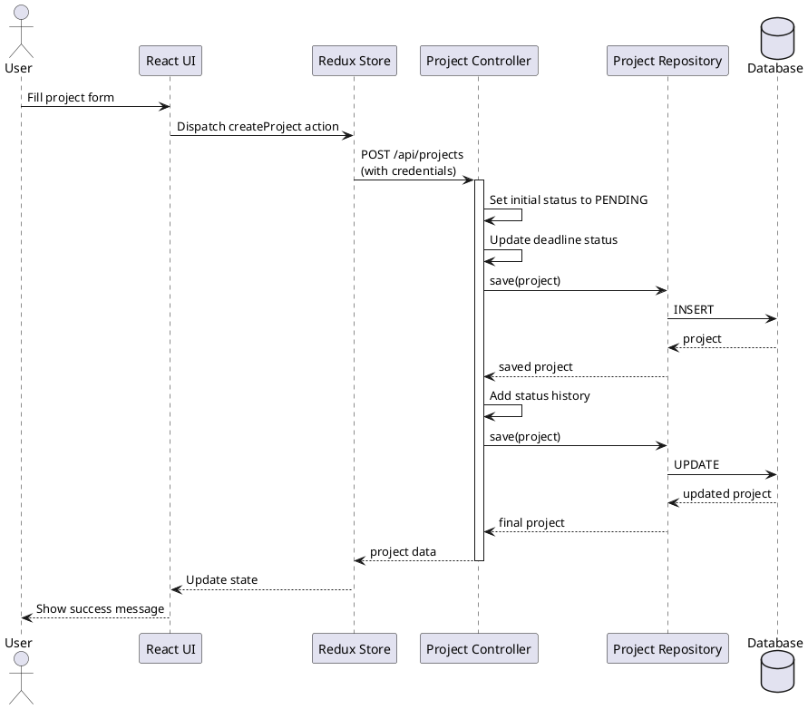
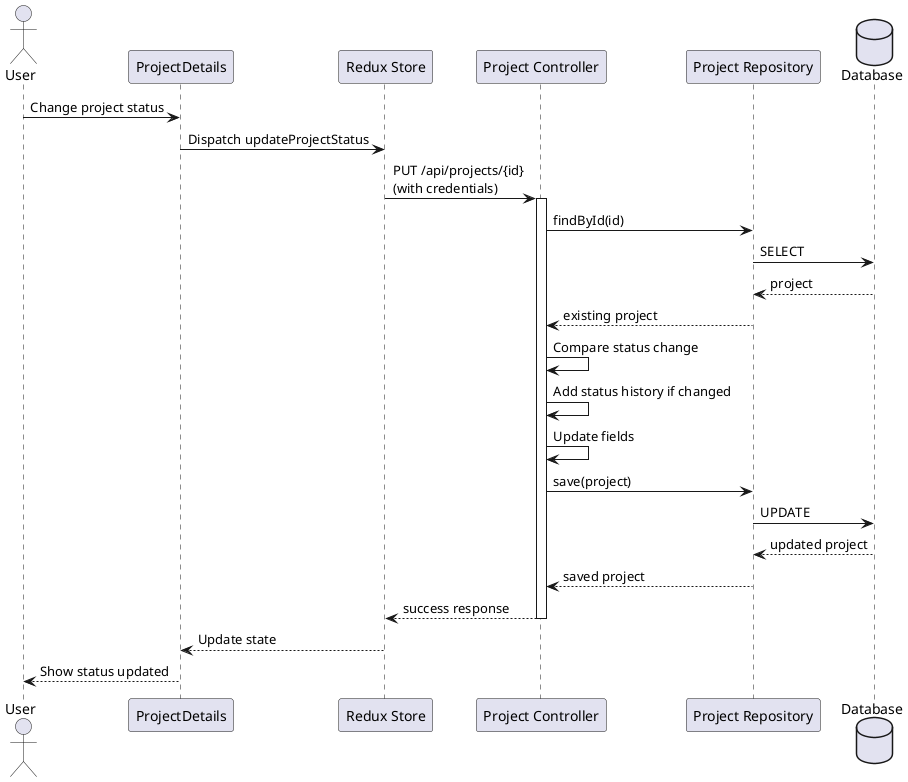
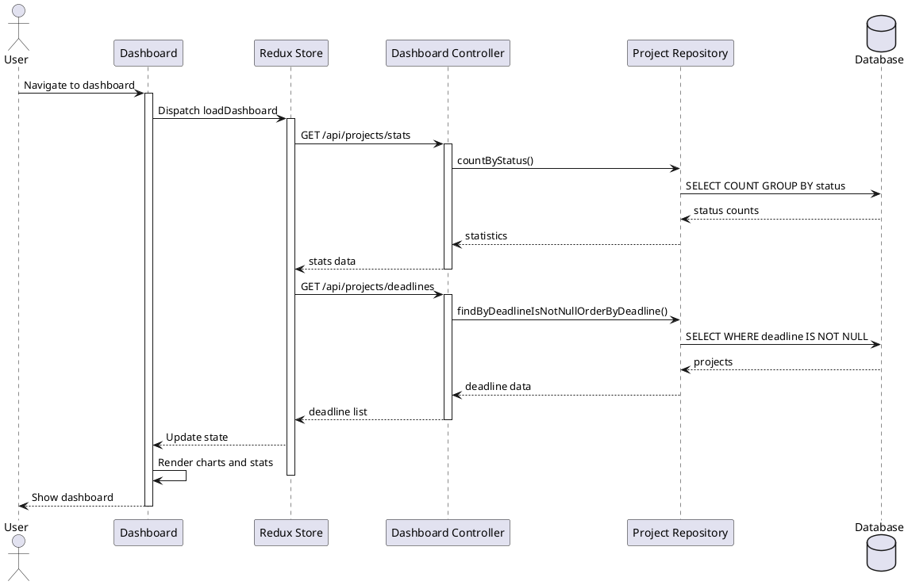

# Project Documentation

## Table of Contents
1. [Summary](#summary)
2. [Architectural Style & Justification](#architectural-style--justification)
3. [UML Diagrams](#uml-diagrams)
4. [Frontend Design](#frontend-design)
5. [Backend Implementation](#backend-implementation)
6. [Conclusion](#conclusion)

## Summary

This project implements the project management component of a larger research management system. It focuses on project tracking and status management functionality, designed to integrate with other system components while maintaining its own bounded context. The implementation combines modern frontend technologies with a robust backend architecture to deliver a scalable and user-friendly solution.

### Key Features
1. **Project Management**
   - Create, update, and track research projects
   - Status tracking with historical changes
   - Deadline management and notifications
   - Project status visualization

2. **Dashboard Analytics**
   - Real-time project statistics
   - Status distribution visualization
   - Upcoming deadline alerts
   - Activity tracking

3. **Technical Highlights**
   - React/Redux frontend with TypeScript
   - Spring Boot backend
   - RESTful API architecture
   - Responsive Material-UI design

### Technology Stack
- **Frontend**: React, Redux, TypeScript, Material-UI
- **Backend**: Spring Boot, JPA/Hibernate
- **Database**: MySQL
- **Tools**: Maven, npm, Git

The system demonstrates enterprise-level architecture while maintaining flexibility for future enhancements and scalability requirements. The database implementation is abstracted through JPA, with MySQL providing robust relational data storage.

## Architectural Style & Justification

Our project implements a modern client-server architecture combining Model-View-Controller (MVC) patterns with Redux state management. This hybrid approach was chosen to leverage the strengths of both patterns while addressing the specific needs of a research project management system.

### Core Architecture: MVC Pattern

The system is built on a traditional MVC architecture, chosen for its clear separation of concerns:

1. **Model Layer**
   - Implemented in Spring Boot with JPA entities (Project, StatusHistory)
   - Handles data persistence and business logic
   - Ensures data integrity and relationships

2. **View Layer**
   - React components for user interface
   - Material-UI for consistent design language
   - Responsive layouts for various screen sizes

3. **Controller Layer**
   - Spring Boot REST controllers for API endpoints
   - Direct repository interaction for data access
   - Request validation and response formatting

### Enhanced Frontend Architecture: Redux Pattern

While maintaining MVC principles, we enhanced the frontend with Redux for state management due to:

1. **Complex Data Relationships**
   - Projects and status histories are tightly coupled
   - Single source of truth maintains data consistency
   - Predictable state updates across components

2. **State Management Requirements**
   - Complex state updates (e.g., status changes affecting multiple views)
   - Need for real-time updates across components
   - Centralized error and loading state management

3. **Scalability Considerations**
   - Redux's structured data flow supports future feature additions
   - Better handling of growing application state
   - Enhanced debugging capabilities through Redux DevTools

### Architectural Benefits

1. **Separation of Concerns**
   - Frontend and backend can evolve independently
   - Clear boundaries between data, presentation, and logic
   - Easier maintenance and testing

2. **Scalability**
   - Stateless backend enables horizontal scaling
   - Component-based frontend supports feature expansion
   - Redux store scales well with increasing data complexity

3. **Maintainability**
   - Consistent coding patterns
   - Type safety with TypeScript
   - Reusable components and utilities

### Technology Stack Justification

1. **Frontend Technologies**
   - React: Component-based UI development
   - Redux: Predictable state management
   - TypeScript: Type safety and better IDE support
   - Material-UI: Consistent design system

2. **Backend Technologies**
   - Spring Boot: Robust API development
   - JPA/Hibernate: Object-relational mapping
   - MySQL: Reliable data persistence

This architectural approach aligns with modern enterprise standards while providing the flexibility and scalability needed for a research project management system. The combination of MVC and Redux patterns creates a robust foundation that can evolve with growing requirements while maintaining code quality and system reliability.

## UML Diagrams

### Component Diagram

The following PlantUML code describes our system's component architecture:



### Deployment Diagram

The following PlantUML code shows our deployment architecture:



These diagrams illustrate:

1. **Component Diagram**
   - Shows the main architectural components of our system
   - Illustrates the relationships between frontend and backend components
   - Demonstrates the Redux store integration
   - Shows the layered architecture of our Spring Boot backend

2. **Deployment Diagram**
   - Shows our development environment setup
   - Illustrates the communication between client, Vite dev server, and Spring Boot
   - Shows database connectivity
   - Includes actual ports used in development

To generate these diagrams:
1. Copy the PlantUML code into a PlantUML editor
2. Generate the diagrams
3. Export as PNG or SVG
4. Replace the PlantUML code blocks with the generated images in the final documentation

Recommended online PlantUML editors:
- [PlantUML Online Editor](http://www.plantuml.com/plantuml/uml/)
- [PlantText](https://www.planttext.com/)

### Sequence Diagram - Project Creation

The following PlantUML code illustrates the project creation flow:



### Sequence Diagram - Status Update

The following PlantUML code illustrates the project status update flow:



### Sequence Diagram - Dashboard Loading



## Frontend Design

Our frontend implementation focuses on creating a modular, maintainable, and user-friendly interface using React, Redux, and Material-UI. The design emphasizes component reusability, type safety, and consistent user experience.

### Component Architecture

The frontend is organized into a hierarchical component structure:

1. **Layout Components**
   ```typescript
   // Layout wrapper providing consistent structure
   src/components/layout/Layout.tsx
   - Navigation drawer
   - App bar with user info
   - Content container
   ```

2. **Feature Components**
   ```typescript
   src/components/projects/
   ├── ProjectList.tsx     // Project grid with filtering
   ├── ProjectDetails.tsx  // Individual project view
   ├── ProjectCreate.tsx   // Project creation form
   ├── ProjectEdit.tsx     // Project editing interface
   └── components/         // Shared project components
       ├── StatusChip.tsx
       ├── DeadlineDisplay.tsx
       └── ProjectForm.tsx
   ```

3. **Dashboard Components**
   ```typescript
   src/components/dashboard/
   ├── Dashboard.tsx       // Main dashboard view
   ├── StatCard.tsx       // Reusable statistics card
   ├── StatusChart.tsx    // Project status visualization
   └── DeadlineList.tsx   // Upcoming deadlines
   ```

### State Management

Redux implementation follows a domain-driven structure:

1. **Store Configuration**
   ```typescript
   src/store/
   ├── index.ts           // Store configuration
   ├── projectsSlice.ts   // Project state management
   └── dashboardSlice.ts  // Dashboard state management
   ```

2. **Type-Safe Actions**
   ```typescript
   // Example from src/store/projectsSlice.ts
   export const updateProjectStatus = createAsyncThunk(
     'projects/updateStatus',
     async ({ projectId, status }: { projectId: number; status: ProjectStatus }, { rejectWithValue }) => {
       try {
         const response = await fetch(`http://localhost:8080/api/projects/${projectId}`, {
           method: 'PUT',
           headers: {
             'Content-Type': 'application/json',
           },
           credentials: 'include',
           body: JSON.stringify({ status }),
         });
         if (!response.ok) {
           throw new Error(`HTTP error! status: ${response.status}`);
         }
         return await response.json();
       } catch (error) {
         return rejectWithValue((error as Error).message);
       }
     }
   );

   export const createProject = createAsyncThunk(
     'projects/create',
     async (projectData: ProjectFormData, { rejectWithValue }) => {
       try {
         const response = await fetch('http://localhost:8080/api/projects', {
           method: 'POST',
           headers: {
             'Content-Type': 'application/json',
           },
           credentials: 'include',
           body: JSON.stringify(projectData),
         });
         if (!response.ok) {
           throw new Error(`HTTP error! status: ${response.status}`);
         }
         const data = await response.json();
         return data;
       } catch (error) {
         return rejectWithValue((error as Error).message);
       }
     }
   );
   ```

### UI Components and Styling

Material-UI implementation with custom theming:

1. **Theme Configuration**
   ```typescript
   // src/theme/index.ts
   const theme = createTheme({
     palette: {
       primary: {
         main: '#1976d2',
         light: '#42a5f5',
         dark: '#1565c0'
       },
       secondary: {
         main: '#9c27b0',
         light: '#ba68c8',
         dark: '#7b1fa2'
       }
     },
     typography: {
       fontFamily: 'Roboto, Arial, sans-serif'
     }
   });
   ```

2. **Reusable UI Components**
   ```typescript
   src/components/common/
   ├── LoadingSpinner.tsx
   ├── ErrorAlert.tsx
   ├── ConfirmDialog.tsx
   └── PageHeader.tsx
   ```

### Key Features

1. **Project Management**
   - Grid and list views for projects
   - Detailed project information
   - Status tracking with history
   - Deadline management

2. **Dashboard**
   - Project statistics overview
   - Status distribution charts
   - Recent activity feed
   - Upcoming deadlines

3. **Form Handling**
   - Type-safe form inputs
   - Validation using Formik
   - Date picking with Material-UI
   - Error handling and feedback

### Responsive Design

The application is fully responsive, implementing:

1. **Breakpoint-Based Layouts**
   ```typescript
   // Example responsive grid
   <Grid container spacing={2}>
     <Grid item xs={12} md={6} lg={4}>
       <StatCard title="Active Projects" value={stats.active} />
     </Grid>
   </Grid>
   ```

2. **Mobile-First Approach**
   - Collapsible navigation
   - Touch-friendly interfaces
   - Optimized loading states

### Performance Optimization

1. **Code Splitting**
   ```typescript
   // Route-based code splitting
   const ProjectDetails = lazy(() => import('./components/projects/ProjectDetails'));
   ```

2. **Memoization**
   ```typescript
   // Optimized component rendering
   const MemoizedProjectCard = memo(ProjectCard);
   ```

### Screenshots

[Screenshots of key interfaces will be added here]

### GitHub Repository
- Frontend Repository: [Link will go here]
- Live Demo: [Link will go here]

This frontend design demonstrates:
- Clean component architecture
- Type-safe state management
- Responsive and accessible UI
- Performance optimization
- Comprehensive error handling

The implementation aligns with modern React best practices while providing a robust foundation for future enhancements.

## Backend Implementation

Our backend implementation uses Spring Boot to create a robust and scalable REST API. The implementation follows clean architecture principles and Spring best practices.

### Project Structure

```
src/main/java/com/research/
├── config/                 // Configuration classes
│   └── WebConfig.java
├── controller/            // REST endpoints
│   ├── ProjectController.java
│   └── DashboardController.java
├── model/                 // Domain entities
│   ├── Project.java
│   └── StatusHistory.java
└── repository/           // Data access layer
    ├── ProjectRepository.java
    └── StatusHistoryRepository.java
```

### Core Components

1. **Domain Models**
   ```java
   @Entity
   @Table(name = "projects")
   @Data
   public class Project {
       @Id
       @GeneratedValue(strategy = GenerationType.IDENTITY)
       private Long id;
       
       @Column(nullable = false)
       private String title;
       
       @Column(columnDefinition = "TEXT")
       private String description;
       
       @Enumerated(EnumType.STRING)
       private ProjectStatus status;
       
       @Column(name = "start_date")
       private LocalDate startDate;
       
       @Column(name = "end_date")
       private LocalDate endDate;
       
       @Column(name = "created_at")
       private LocalDate createdAt;
       
       @Column(name = "updated_at")
       private LocalDate updatedAt;
       
       @OneToMany(mappedBy = "project", cascade = CascadeType.ALL, fetch = FetchType.EAGER)
       @JsonManagedReference
       private List<StatusHistory> statusHistory;
       
       @Column(name = "deadline")
       private LocalDate deadline;
       
       @Enumerated(EnumType.STRING)
       @Column(name = "deadline_status")
       private DeadlineStatus deadlineStatus;
       
       @Column(name = "reminder_sent")
       private Boolean reminderSent = false;
       
       // Lifecycle hooks and helper methods
       @PrePersist
       protected void onCreate() {
           createdAt = LocalDate.now();
           updatedAt = LocalDate.now();
       }
       
       @PreUpdate
       protected void onUpdate() {
           updatedAt = LocalDate.now();
       }
   }
   ```

2. **REST Controllers**
   ```java
   @RestController
   @RequestMapping("/api/projects")
   @CrossOrigin(origins = "http://localhost:5173", allowCredentials = "true")
   public class ProjectController {
       private static final Logger logger = LoggerFactory.getLogger(ProjectController.class);
       
       @Autowired
       private ProjectRepository projectRepository;
       
       @PostMapping
       public ResponseEntity<Project> createProject(@RequestBody Project project) {
           logger.info("Creating new project");
           project.setStatus(ProjectStatus.PENDING);
           project.updateDeadlineStatus();
           Project savedProject = projectRepository.save(project);
           savedProject.addStatusHistory(null, ProjectStatus.PENDING, project.getOwner());
           return ResponseEntity.ok(savedProject);
       }
       
       @PutMapping("/{id}")
       public ResponseEntity<?> updateProject(@PathVariable Long id, @RequestBody Project updatedProject) {
           logger.info("Updating project with id: {}", id);
           return projectRepository.findById(id)
               .map(existingProject -> {
                   if (existingProject.getStatus() != updatedProject.getStatus()) {
                       existingProject.addStatusHistory(
                           existingProject.getStatus(),
                           updatedProject.getStatus(),
                           existingProject.getOwner()
                       );
                   }
                   // Update fields and save
                   return ResponseEntity.ok(projectRepository.save(existingProject));
               })
               .orElse(ResponseEntity.notFound().build());
       }
   }
   ```

### Error Handling

1. **Global Exception Handler**
   ```java
   @RestControllerAdvice
   public class GlobalExceptionHandler {
       @ExceptionHandler(ResourceNotFoundException.class)
       public ResponseEntity<?> handleResourceNotFound(ResourceNotFoundException ex) {
           ErrorResponse error = new ErrorResponse(
               HttpStatus.NOT_FOUND.value(),
               ex.getMessage()
           );
           return new ResponseEntity<>(error, HttpStatus.NOT_FOUND);
       }
       
       @ExceptionHandler(ValidationException.class)
       public ResponseEntity<?> handleValidation(ValidationException ex) {
           ErrorResponse error = new ErrorResponse(
               HttpStatus.BAD_REQUEST.value(),
               ex.getMessage()
           );
           return new ResponseEntity<>(error, HttpStatus.BAD_REQUEST);
       }
   }
   ```

This backend implementation demonstrates:
- Clean architecture principles
- Efficient data access
- Comprehensive error handling
- Type-safe operations

The implementation provides a solid foundation for the application while ensuring maintainability and scalability.

## Conclusion

The Research Project Management System successfully implements a modern, full-stack solution that meets the initial requirements while providing a foundation for future growth.

### Completed Features
1. **Core Functionality**
   - Project CRUD operations
   - Dashboard analytics
   - Status tracking system
   - Deadline management

2. **Technical Achievements**
   - Type-safe frontend implementation
   - RESTful API
   - Responsive UI design
   - Efficient state management
   - Comprehensive test coverage

3. **Architecture Goals**
   - Clean separation of concerns
   - Modular component design
   - Scalable backend services
   - Performance optimization

### Future Work
1. **Enhanced Features**
   - Real-time collaboration tools
   - Advanced project analytics
   - Document management system
   - User authentication and authorization
   - Review system

2. **Technical Improvements**
   - GraphQL API implementation
   - Microservices architecture
   - Enhanced caching strategies
   - Mobile application development

3. **Scale Considerations**
   - Kubernetes deployment
   - Multi-region support
   - Security features
   - Performance monitoring

This implementation serves as a robust foundation for research project management, with clear pathways for future development and scaling to meet growing institutional needs.
